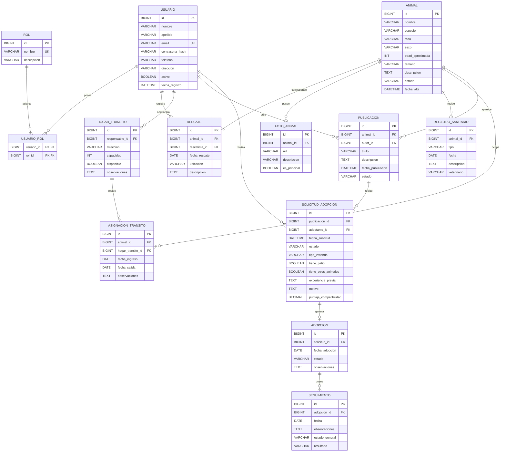

# Diagrama entidad-relación

El siguiente diagrama representa el modelo inicial de la base de datos de RescuePet.

```mermaid
erDiagram
    USUARIO {
        BIGINT id PK
        VARCHAR nombre
        VARCHAR apellido
        VARCHAR email UK
        VARCHAR contrasena_hash
        VARCHAR telefono
        VARCHAR direccion
        BOOLEAN activo
        DATETIME fecha_registro
    }

    ROL {
        BIGINT id PK
        VARCHAR nombre UK
        VARCHAR descripcion
    }

    USUARIO_ROL {
        BIGINT usuario_id PK, FK
        BIGINT rol_id PK, FK
    }

    ANIMAL {
        BIGINT id PK
        VARCHAR nombre
        VARCHAR especie
        VARCHAR raza
        VARCHAR sexo
        INT edad_aproximada
        VARCHAR tamano
        TEXT descripcion
        VARCHAR estado
        DATETIME fecha_alta
    }

    RESCATE {
        BIGINT id PK
        BIGINT animal_id FK
        BIGINT rescatista_id FK
        DATE fecha_rescate
        VARCHAR ubicacion
        TEXT descripcion
    }

    FOTO_ANIMAL {
        BIGINT id PK
        BIGINT animal_id FK
        VARCHAR url
        VARCHAR descripcion
        BOOLEAN es_principal
    }

    REGISTRO_SANITARIO {
        BIGINT id PK
        BIGINT animal_id FK
        VARCHAR tipo
        DATE fecha
        TEXT descripcion
        VARCHAR veterinario
    }

    HOGAR_TRANSITO {
        BIGINT id PK
        BIGINT responsable_id FK
        VARCHAR direccion
        INT capacidad
        BOOLEAN disponible
        TEXT observaciones
    }

    ASIGNACION_TRANSITO {
        BIGINT id PK
        BIGINT animal_id FK
        BIGINT hogar_transito_id FK
        DATE fecha_ingreso
        DATE fecha_salida
        TEXT observaciones
    }

    PUBLICACION {
        BIGINT id PK
        BIGINT animal_id FK
        BIGINT autor_id FK
        VARCHAR titulo
        TEXT descripcion
        DATETIME fecha_publicacion
        VARCHAR estado
    }

    SOLICITUD_ADOPCION {
        BIGINT id PK
        BIGINT publicacion_id FK
        BIGINT adoptante_id FK
        DATETIME fecha_solicitud
        VARCHAR estado
        VARCHAR tipo_vivienda
        BOOLEAN tiene_patio
        BOOLEAN tiene_otros_animales
        TEXT experiencia_previa
        TEXT motivo
        DECIMAL puntaje_compatibilidad
    }

    ADOPCION {
        BIGINT id PK
        BIGINT solicitud_id FK
        DATE fecha_adopcion
        VARCHAR estado
        TEXT observaciones
    }

    SEGUIMIENTO {
        BIGINT id PK
        BIGINT adopcion_id FK
        DATE fecha
        TEXT observaciones
        VARCHAR estado_general
        VARCHAR resultado
    }

    USUARIO ||--o{ USUARIO_ROL : posee
    ROL ||--o{ USUARIO_ROL : asigna
    USUARIO ||--o{ RESCATE : registra
    ANIMAL ||--|| RESCATE : corresponde
    ANIMAL ||--o{ FOTO_ANIMAL : posee
    ANIMAL ||--o{ REGISTRO_SANITARIO : recibe
    USUARIO ||--o{ HOGAR_TRANSITO : administra
    ANIMAL ||--o{ ASIGNACION_TRANSITO : ocupa
    HOGAR_TRANSITO ||--o{ ASIGNACION_TRANSITO : recibe
    USUARIO ||--o{ PUBLICACION : crea
    ANIMAL ||--o{ PUBLICACION : aparece
    PUBLICACION ||--o{ SOLICITUD_ADOPCION : recibe
    USUARIO ||--o{ SOLICITUD_ADOPCION : realiza
    SOLICITUD_ADOPCION ||--o| ADOPCION : genera
    ADOPCION ||--o{ SEGUIMIENTO : posee
```
